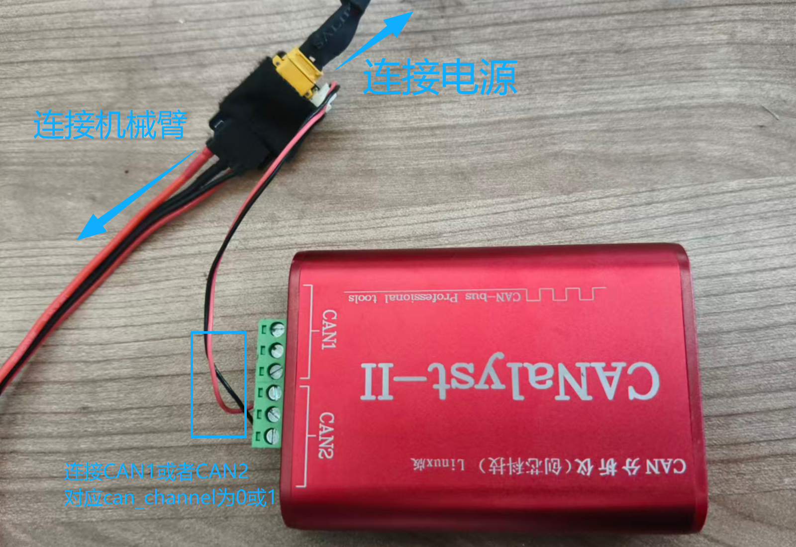
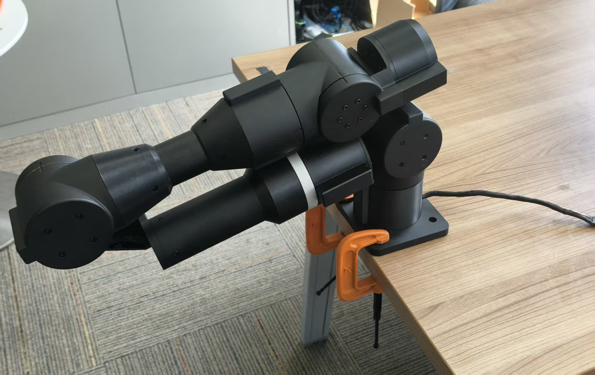
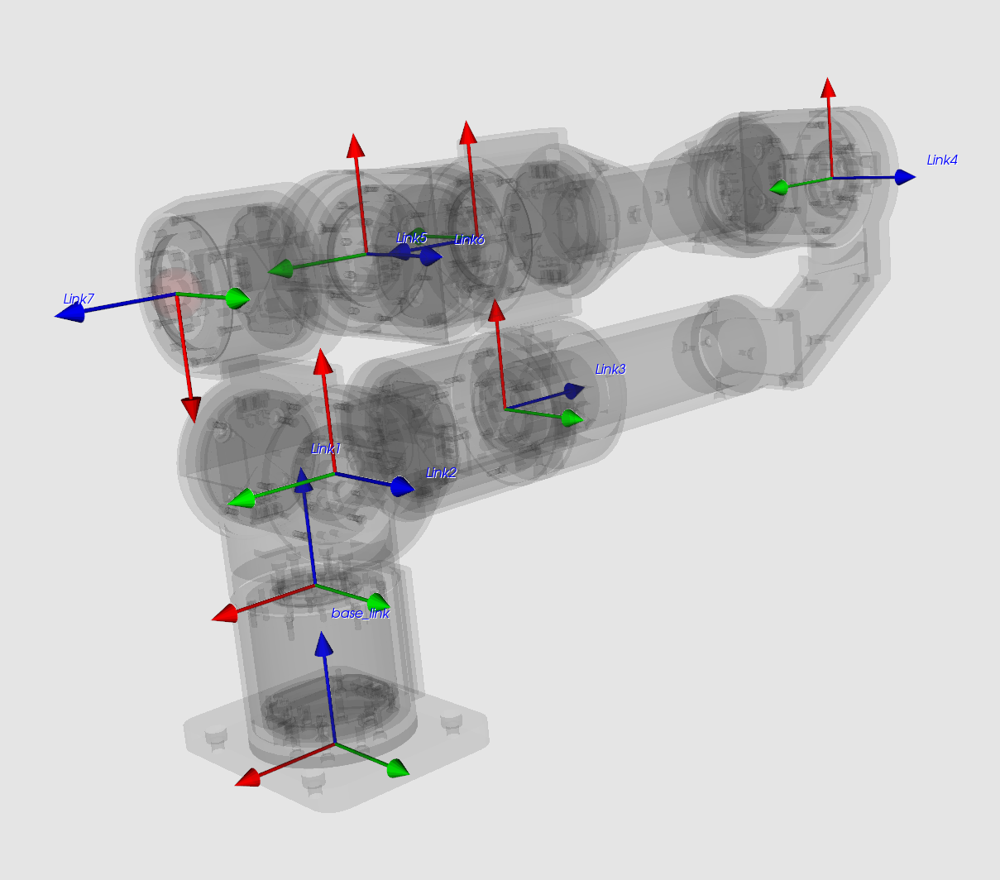

# libgx7文档

## 运行环境

* Ubuntu 20.04、22.04
* Python 3.8+

## USB2CAN权限设置
执行如下代码设置USB2CAN权限，然后重新拔插USB或者重启：
```
sudo cp hardware/99-myusb.rules /etc/udev/rules.d/
sudo udevadm control --reload-rules
sudo udevadm trigger
```

## USB2CAN连接

USB2CAN具有两个CAN通道，外壳上分别印有CAN1、CAN2，对应代码中的`can_channel=0`和`can_channel=1`。连接方式如下：



## 机械臂安装方式

机械臂通过两个G型钳安装在桌面边缘，如下：



机械臂坐标轴如下：




机械臂的URDF模型在[gx7_description](https://github.com/Democratizing-Dexterous/gx7_description)。

## 代码示例

```python
import numpy as np
from robot import GX7
from hardware.can import VCICAN

can = VCICAN()
can.init_can()
FREQ = 200  # Hz
robot = GX7(can, can_channel=1, freq=FREQ, control_mode="pvt") # 如果使用CAN2通道连接机械臂，can_channel=1
robot.setup()
robot.run()  # Start the robot thread
```

通过`can_channel`的指定，可以实现一个USB2CAN同时连接机械臂的场景，如下：

```python
robot1 = GX7(can, can_channel=0, freq=FREQ, control_mode="pvt")
robot2 = GX7(can, can_channel=1, freq=FREQ, control_mode="pvt")
```


## 逆运动学示例

关于7轴逆运动学求解的代码在`examples/sew_ik.py`中，代码演示了7轴逆解具有连续变化的过程，即不同臂角参数`psi`的变化，关节角度求解不一样，而末端位姿保持不变。

## 注意事项

* 代码退出后，机械臂会自动停止运动，在重力作用下会有阻力的下坠。
* 断电后，机械臂会直接下坠，注意保护好机械臂，避免损坏。