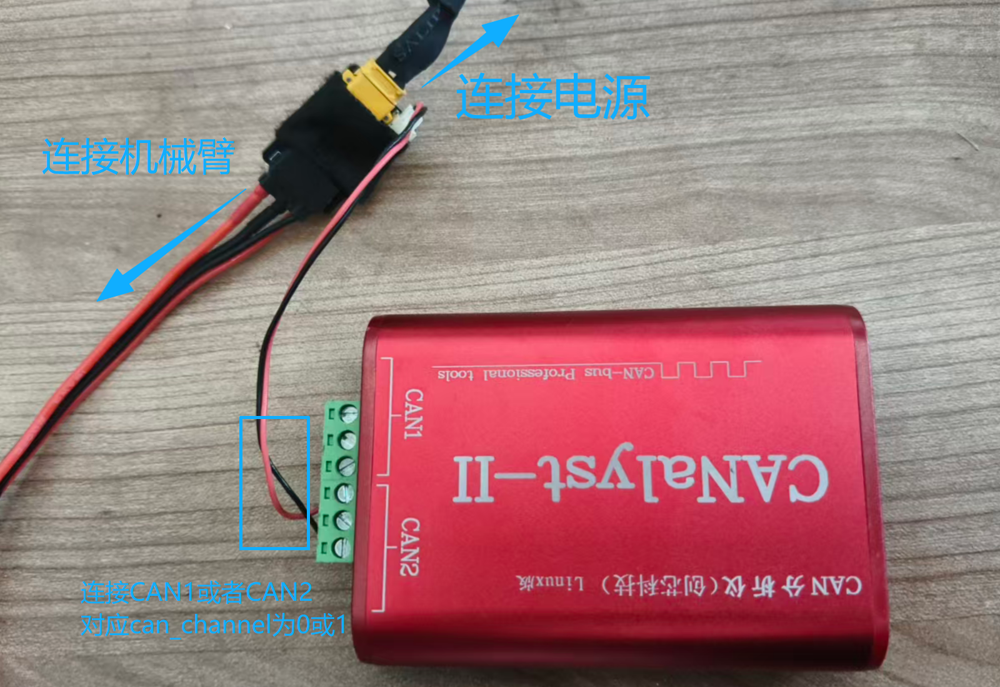
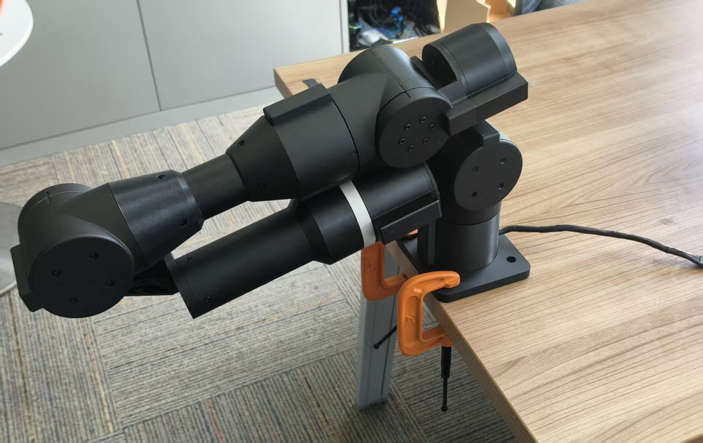
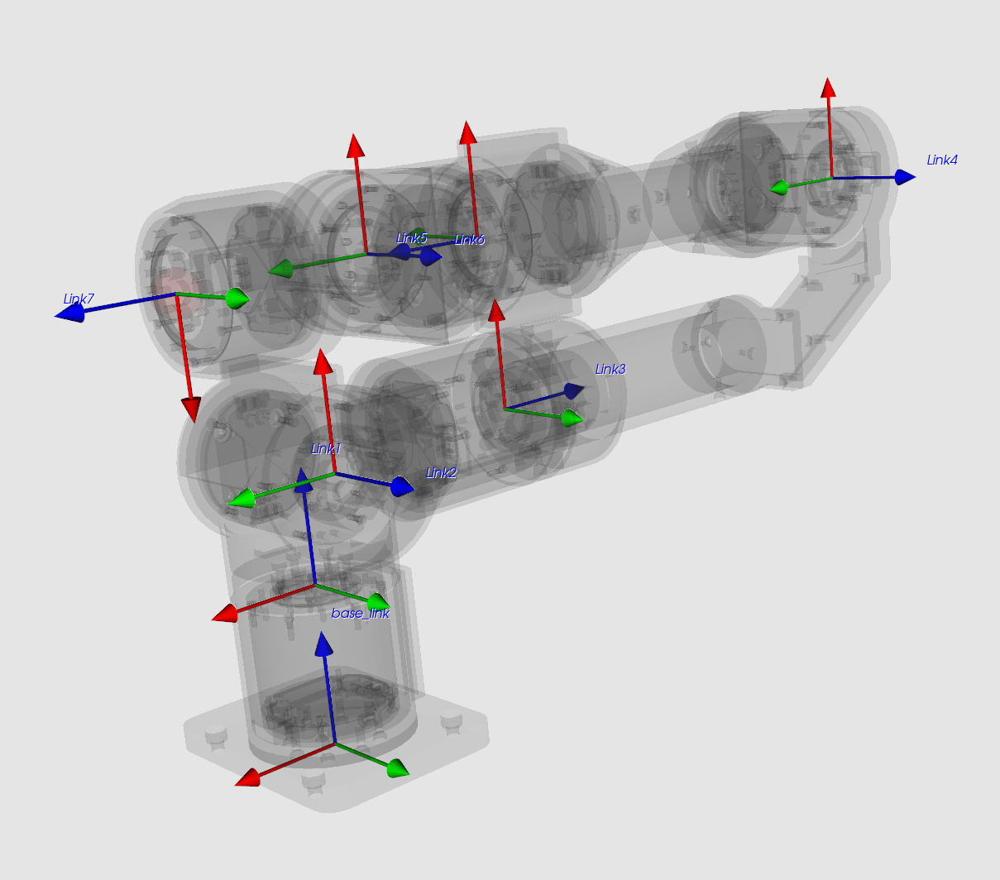
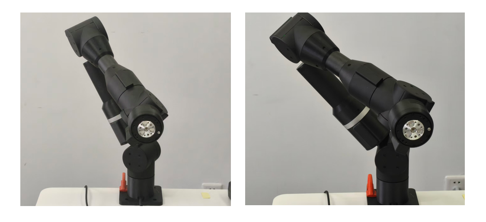

# libgx7

> GX7 机械臂 Python 控制库，支持 USB2CAN 通信、双通道连接、7 轴逆运动学与带夹爪版本配置。

## ✨ 特性

- 支持 **Ubuntu 20.04 / 22.04**
- 支持 **Python 3.8+**
- 支持 **USB2CAN 双 CAN 通道**
- 支持 **GX7 机械臂** 与 **带夹爪版本**
- 提供 **7 轴逆运动学示例**
- 提供 **API 文档** 与 **动力学辨识工具**

---

## 🧰 运行环境

- Ubuntu 20.04 / 22.04
- Python 3.8+ （与ROS2集成使用Python 3.10）

---

## 📦 安装方式

在项目根目录执行：

```bash
pip install -e .
```

---

## 🔐 USB2CAN 权限设置

首次使用 USB2CAN 前，请执行以下命令配置设备权限。执行完成后，**重新拔插 USB 设备**，或**重启系统**使配置生效。

```bash
sudo cp libgx7/hardware/99-myusb.rules /etc/udev/rules.d/
sudo udevadm control --reload-rules
sudo udevadm trigger
```

---

## 🔌 USB2CAN 连接说明

USB2CAN 设备包含两个 CAN 通道，外壳上标记为：

- **CAN1** → 对应代码中的 `can_channel=0`
- **CAN2** → 对应代码中的 `can_channel=1`

<div align="center">
  
</div>

> 💡 使用时请确认硬件接入的通道编号与代码中的 `can_channel` 保持一致。

---

## 🛠️ 机械臂安装方式

机械臂通过两个 **G 型夹** 固定在桌面边缘，如下图所示：

<div align="center">
  
</div>

机械臂坐标轴定义如下：

<div align="center">
  
</div>

机械臂的 URDF 模型请参考：

- [gx7_description](https://github.com/Democratizing-Dexterous/gx7_description)

---

## 🚀 快速开始

### 交互式 CLI（推荐用于快速调试）

项目提供了一个交互式入口脚本 [`cli.py`](cli.py)。
推荐通过 Python 交互模式启动，这样初始化完成后不会退出，你可以直接在终端里调用 `robot.xxx(...)`：

```bash
python -i cli.py
```

启动成功后，会预先创建并启动以下对象：

- `can`：`VCICAN` 实例（已 `init_can()`）
- `robot`：`GX7` 实例（已 `setup()` 且已 `run()`）
- `FREQ`：控制频率（默认 `100` Hz）

你可以直接输入命令控制机械臂，例如：

```python
# 查看当前关节位置
robot.getJP()

# 发送 7 轴 PVT 目标（位置/速度/力矩比例）
robot.setJPVTs([0, 0, 0, 0, 0, 0, 0], [0.2]*7, [0.6]*7)

# 单关节控制示例（按你实际 API 使用）
# robot.setJPVT(joint_id, pos, vel, tau_ratio)
```

> ⚠️ 注意
> 1. `python cli.py` 与 `python -i cli.py` 不同：前者脚本执行完会退出，后者会保留交互终端。
> 2. 交互调试时避免“无 sleep 的死循环”疯狂发指令，防止 CPU 占用过高影响线程调度与通信稳定性。
> 3. 退出前建议先让机械臂回到安全姿态或停止输出，再 `Ctrl-D` / `exit()` 退出。

### 基础初始化示例（轻量计算任务）

```python
import numpy as np
from libgx7 import VCICAN, GX7
import time

can = VCICAN()
can.init_can()

FREQ = 200  # Hz

# 如果使用 CAN1 通道连接机械臂，can_channel=0
# 如果使用 CAN2 通道连接机械臂，can_channel=1
robot = GX7(
    can,
    can_channel=1,
    freq=FREQ,
    control_mode="pvt",
    soft_limits=True,
    config="gx7.yaml",
)

robot.setup()
robot.run()   # 启动机器人内部控制线程

#⚠️说明：
# 适合处理轻量级业务逻辑，复杂计算会导致run线程波动变大，影响控制实时性

while True:
  robot.setJPVTs([0]*7, [0.2]*7, [0.6]*7) #控制到0位，0.2速度，60%最大力矩

  #⚠️重要：这里的 setJPVTs 只是更新目标指令，实际发送频率由 robot.run() 内部控制循环决定。
  # 如果外部 while True 不加 sleep，会形成忙等，CPU 占用飙升，并影响线程调度稳定性，会造成关节通信丢失
  time.sleep(1 / FREQ)

```

如果需要进行视觉感知等复杂计算进行机械臂控制，建议使用ROS2进行集成。

### ROS2 节点启动（推荐用于系统集成）

当需要与 ROS2 生态（话题、服务、TF、可视化等）集成时，使用项目内置节点：

```bash
python gx7_ros2_node.py
```

> 建议在运行前确认：
> 1. USB2CAN 权限已按本文前文配置；
> 2. `can_channel` 与实际硬件连接一致；
> 3. 配置文件选择正确（`gx7.yaml` 或 `gx7-gripper.yaml`）。

#### ROS2 参数

`gx7_ros2_node.py` 支持以下参数（可通过 `--ros-args -p` 传入）：

- `can_channel`（int，默认 `1`）：USB2CAN 通道，`0` 对应 CAN1，`1` 对应 CAN2
- `freq`（int，默认 `100`）：机器人内部控制线程频率（Hz）
- `control_mode`（str，默认 `pvt`）：初始控制模式，支持 `pvt` / `pv` / `mit`
- `soft_limit`（bool，默认 `False`）：是否启用关节软限位检查
- `config`（str，默认 `gx7.yaml`）：机械臂配置文件
- `publish_rate`（float，默认 `100.0`）：状态发布频率（Hz）
- `topic_prefix`（str，默认 `/gx7`）：ROS2 话题/服务前缀

示例：

```bash
python gx7_ros2_node.py --ros-args \
  -p can_channel:=1 \
  -p freq:=100 \
  -p control_mode:=pvt \
  -p soft_limit:=false \
  -p config:=gx7.yaml \
  -p publish_rate:=100.0 \
  -p topic_prefix:=/gx7
```

> `topic_prefix` 支持自定义命名空间，例如 `/my_arm`，便于多机械臂系统集成。

#### Python ROS2 控制示例位置

项目提供了一个最简 Python ROS2 控制示例：

- [`scripts/ros2_control_demo.py`](scripts/ros2_control_demo.py)

该示例演示了完整流程：订阅状态、切换到 PVT、发布 `joints_goal` 控制并打印关节角度、查询当前 mode。

运行方式（先启动 `gx7_ros2_node.py`）：

```bash
python scripts/ros2_control_demo.py --ros-args -p topic_prefix:=/gx7
```

#### ROS2 接口说明

以下接口默认以 `topic_prefix=/gx7` 为例；若你修改前缀（如 `/my_arm`），请将所有 `/gx7/...` 替换为 `/my_arm/...`。

**1) 状态发布 Topic**

- `/gx7/joints_published`（`sensor_msgs/msg/JointState`）
  - `position`：关节位置（rad）
  - `velocity`：关节速度（rad/s）
  - `effort`：关节力矩（Nm）

查看：

```bash
ros2 topic echo /gx7/joints_published
```

**2) 目标命令 Topic（统一入口）**

- `/gx7/joints_goal`（`sensor_msgs/msg/JointState`）

该话题根据当前控制模式自动解释消息字段：

- 当前模式 `MIT`：使用 `effort` 作为力矩命令（长度需等于 DOF）
- 当前模式 `PV`：使用 `position` + `velocity`
- 当前模式 `PVT`：使用 `position` + `velocity` + `effort`

> 建议始终发送完整长度的 `position/velocity/effort` 数组（长度均为关节数），避免因模式切换导致字段缺失。

发布示例（7 轴）：

```bash
ros2 topic pub /gx7/joints_goal sensor_msgs/msg/JointState "{
  position: [0.0, 0.0, 0.0, 0.0, 0.0, 0.0, 0.0],
  velocity: [0.2, 0.2, 0.2, 0.2, 0.2, 0.2, 0.2],
  effort:   [0.6, 0.6, 0.6, 0.6, 0.6, 0.6, 0.6]
}"
```

**3) 模式相关 Service**

- `/gx7/mode`（`std_srvs/srv/Trigger`）
  - 返回当前模式字符串（`pvt` / `pv` / `mit`）

- `/gx7/set_pvt`（`std_srvs/srv/SetBool`）
- `/gx7/set_mit`（`std_srvs/srv/SetBool`）
- `/gx7/set_pv`（`std_srvs/srv/SetBool`）

以上三个切换服务均为：`data=true` 时执行切换；`data=false` 不切换并返回失败信息。

调用示例：

```bash
# 查询模式
ros2 service call /gx7/mode std_srvs/srv/Trigger "{}"

# 切换模式
ros2 service call /gx7/set_pvt std_srvs/srv/SetBool "{data: true}"
ros2 service call /gx7/set_mit std_srvs/srv/SetBool "{data: true}"
ros2 service call /gx7/set_pv  std_srvs/srv/SetBool "{data: true}"
```

#### 推荐控制流程

1. 启动节点并确认 `/gx7/joints_published` 正常发布
2. 调用 `/gx7/set_xxx` 切换到目标模式
3. 通过 `/gx7/joints_goal` 连续发布控制命令
4. 用 `/gx7/mode` 与 `/gx7/joints_published` 做运行时校验

> 若你使用标准 ROS2 工作流，可进一步封装为 launch 启动，便于统一管理日志与参数。

---

## 🔀 单个 USB2CAN 连接两台机械臂

通过指定不同的 `can_channel`，可以使用一个 USB2CAN 同时连接两台机械臂：

```python
robot1 = GX7(can, can_channel=0, freq=FREQ, control_mode="pvt")
robot2 = GX7(can, can_channel=1, freq=FREQ, control_mode="pvt")
```

---

## 🤏 带夹爪版本初始化

如果使用的是**带夹爪版本**的 GX7，请使用对应配置文件初始化：

```python
robot = GX7(
    can,
    can_channel=1,
    freq=FREQ,
    control_mode="pvt",
    soft_limits=True,
    config="gx7-gripper.yaml",
)
```

> 📌 注意：夹爪本质上也是一个转动关节（`id=8`），因此兼容以下接口：
>
> - `getJP`
> - `setJPVT`
> - `setJPVTs`
> - 以及其他面向关节控制的方法

---

## 🧠 逆运动学示例

7 轴逆运动学示例代码位于[`scripts/sew_ik.py`](scripts/sew_ik.py)
：

```bash
python scripts/sew_ik.py
```

该示例演示了 **7 轴机械臂逆解的连续变化过程**：
在末端位姿保持不变的情况下，随着不同臂角参数 `psi` 的变化，得到的关节角解也会不同。

逆运动学解析解代码移植自：

- [https://github.com/rpiRobotics/stereo-sew](https://github.com/rpiRobotics/stereo-sew)

下图展示了：**相同末端位姿下，不同 `psi` 对应的不同关节状态**。

<div align="center">
  
</div>

---

## 📚 文档

- [API 文档](docs/api.md)
- [动力学辨识说明](scripts/dynamics/readme.md)

---

## ⚠️ 注意事项

- 程序退出后，机械臂会**自动停止运动**。在重力作用下，机械臂可能会有一定阻力地下坠。
- 机械臂**断电后会直接下坠**，请务必做好防护，避免设备损坏或造成人员风险。

---

## ⚙️ 配置说明

默认机械臂配置文件为 [`gx7.yaml`](libgx7/hardware/configs/gx7.yaml)。该文件定义了：

- 电机类型参数
- 电机数量
- 每个关节的角度限制

例如：

- `dmj4310`
- `dmj4340`

并支持为每个关节单独设置位置上下限。

如果需要使用带夹爪版本，请切换到：

```yaml
gx7-gripper.yaml
```

> 💡 建议根据实际机械结构与安装方式，认真检查各关节限位配置，确保运动安全。

---

## ✅ 项目结构建议阅读顺序

如果你是第一次使用本项目，建议按以下顺序阅读：

1. 安装依赖
2. 配置 USB2CAN 权限
3. 检查 USB2CAN 通道连接
4. 使用 `gx7.yaml` 初始化机械臂
5. 运行基础控制示例
6. 阅读 API 文档
7. 尝试逆运动学与动力学辨识示例

---

## 🙌 备注

如果你在使用过程中遇到问题，建议优先检查：

- USB2CAN 权限是否配置正确
- `can_channel` 是否与实际硬件连接一致
- 配置文件是否选择正确（`gx7.yaml` / `gx7-gripper.yaml`）
- 关节限位是否合理
- 机械臂是否处于安全安装状态

---
