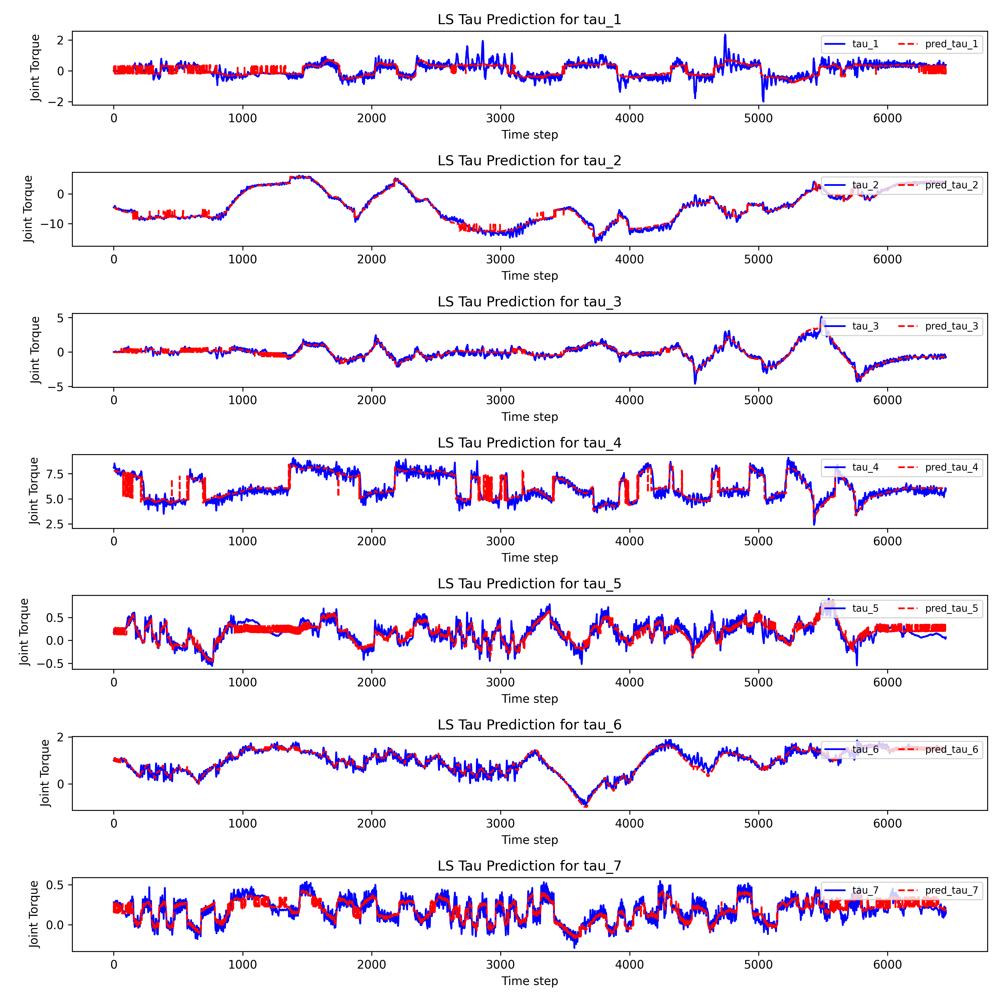

## Dynamics Identification and Zero Force Control

### Collection of Trajectories

```
python collect_traj.py
```

After running you can hold the GX7 to move around. The collected points (joint positions) are saved in `data/traj_p.csv`.

Notification:

- DO NOT contact with other objects while collecting the trajectory.
- DO NOT move the joints to the mechanical limits while collecting the trajectory.
- Try to collect more task space points to get a more accurate dynamics model.

```
python run_traj.py
```
This will rerun the collected trajectory in `data/traj_p.csv` and collect joint positions, velocities, and torques in `data/executed_traj_pvt.csv`.

### Identification of Dynamics Model

```
python ls_id.py
```

This will read the executed trajectory from `data/executed_traj_pvt.csv` and identify the dynamics model using least squares. The identified parameters are saved in `ls_id_beta.npy`.

The identified results are shown by:



### Zero Force Control for Gravity Compensation

```
python drag_gravity.py
```

This will run the zero force control for gravity compensation. The robot will try to keep the end-effector at rest while compensating for the gravity.