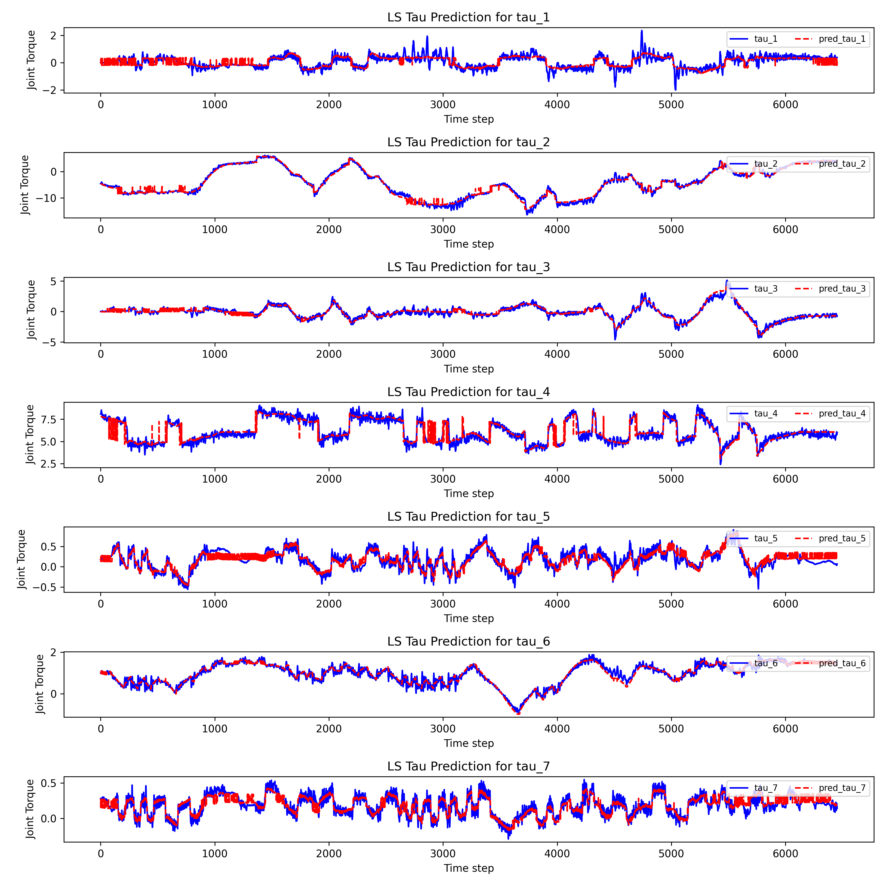

## 动力学辨识与零力控制

### 轨迹采集

```bash
python collect_traj.py
```

运行后可手持 GX7 进行引导运动。采集到的点（关节位置）会保存到 `data/traj_p.csv`。

注意事项：

- 采集轨迹时，**不要**让机械臂与其他物体发生接触。
- 采集轨迹时，**不要**将关节运动到机械限位位置。
- 尽量覆盖更多任务空间点，以获得更准确的动力学模型。

```bash
python run_traj.py
```

该命令会复现 `data/traj_p.csv` 中的采集轨迹，并记录关节位置、速度和力矩，保存到 `data/executed_traj_pvt.csv`。

### 动力学模型辨识

```bash
python ls_id.py
```

该命令会读取 `data/executed_traj_pvt.csv` 中的执行轨迹，使用最小二乘法进行动力学参数辨识，结果保存为 `ls_id_beta.npy`。

辨识结果示意：



### 用于重力补偿的零力控制

```bash
python drag_gravity.py
```

该命令会启动零力控制进行重力补偿。